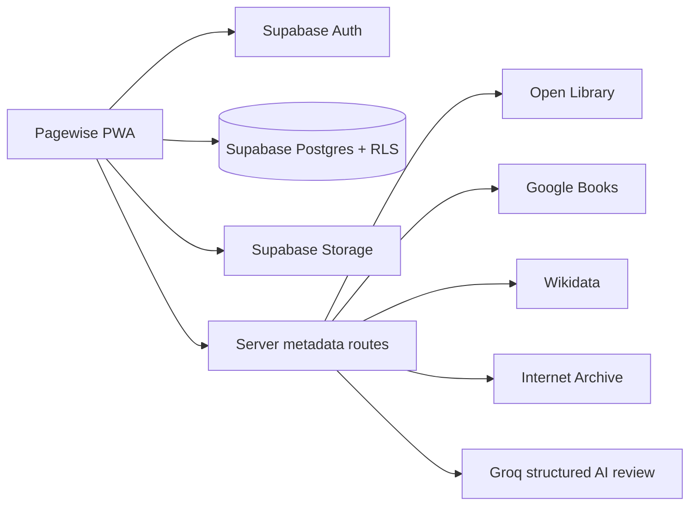

<div align="center">
  

  # Pagewise

  **A private, installable home for your reading life and the books you own.**

  Track books, pages, reading sessions, rereads, diary entries, lists, quotes, goals, and statistics—then catalogue your physical collection with LitShelves.

  [](https://www.typescriptlang.org/)
  [](https://react.dev/)
  [](https://supabase.com/)
  [](https://developer.mozilla.org/docs/Web/Progressive_web_apps)
  [](#quality-and-security)
</div>

---

## About the project

Pagewise combines two connected but deliberately separate tools:

| | Pagewise | LitShelves |
|---|---|---|
| Purpose | Track the books you read | Catalogue the books you physically own |
| Core data | Status, progress, sessions, attempts, ratings, reviews | Edition, quantity, condition, location, value, lending |
| Timeline | Reading diary and rereads | Acquisition and loan history |
| Organization | Custom playlist-style lists, tags, favorites | Author, publisher, genre, language, shelf, and location groups |
| Connection | A reading record can link to an owned copy | An owned copy can be added to Pagewise when you want to read it |

This separation keeps reading history honest: owning a book does not automatically make it a reading record, and reading a book does not imply that you own a copy.

## Highlights

### Reading, your way

- Maintain Want to Read, Reading, Finished, On Hold, and Dropped states.
- Log exact page ranges, quick sessions, notes, and reading dates.
- Finish a book directly from Quick Log, with rating, review, and completion details.
- Preserve permanent reread attempts instead of overwriting earlier history.
- Browse a Letterboxd-inspired finished-book Diary.

### A personal library, not a spreadsheet

- Use cover, compact shelf, or detailed list views.
- Build custom playlist-style book lists with manual ordering.
- Save private quotes, page numbers, commentary, tags, and favorites.
- Search saved books, owned copies, lists, reviews, ISBNs, authors, genres, and internet metadata from one place.

### LitShelves inventory

- Catalogue editions, formats, languages, publishers, ISBNs, quantities, and conditions.
- Record room, shelf, acquisition date, purchase value, and private notes.
- Track lending, borrower, lent date, due date, and returns.
- Import pasted lists or UTF-8 CSV files and export a spreadsheet-safe catalogue.
- Group the collection by author, publisher, genre, language, or physical location.

### Metadata that saves time

- Merge and rank results from Open Library, Google Books, Wikidata, and Internet Archive.
- Search by title, author, or ISBN, with Bengali-first multilingual support.
- Keep unmatched titles as editable manual entries instead of losing them.
- Use optional Groq-assisted review for structured suggestions grounded in provider results.
- Apply suggestions field by field; AI never silently changes saved data.

### Progress and reflection

- View current and personal-best streaks with one monthly freeze.
- Estimate finish dates from recent reading pace.
- Set an annual reading goal and inspect weekly/monthly activity.
- Explore year-specific pages, completed reads, rating distribution, authors, genres, records, and year-over-year comparisons.
- Export selected-year statistics as UTF-8 CSV.

### Installable PWA

- Install Pagewise from a supported desktop or mobile browser.
- Launch it like an app with Add Book and Quick Log shortcuts.
- Receive a controlled update prompt when a new version is ready.
- Use a privacy-safe offline shell that never claims unsaved writes succeeded.

## Design

Pagewise uses a modern reading-room aesthetic: warm paper in light mode, softened charcoal in dark mode, walnut navigation, restrained shelf details, generous spacing, and editorial typography. The responsive interface provides a desktop sidebar, compact mobile navigation, keyboard focus states, safe-area support, and reduced-motion behavior.

## Architecture



- **Application:** React 19, Next.js-compatible App Router APIs, vinext, Vite 8, TypeScript
- **Data platform:** Supabase Authentication, PostgreSQL, Row Level Security, RPCs, and Storage
- **Metadata:** parallel server-side provider pipeline with timeouts, scoring, deduplication, and short caching
- **AI review:** authenticated and rate-limited Groq Responses API using strict JSON Schema
- **Deployment:** Nitro-generated Vercel Build Output API; Cloudflare-powered local preview remains supported
- **Styling:** Tailwind CSS processing plus a project-specific responsive design system

## Local development

### Requirements

- Node.js 22.13 or newer
- npm
- A Supabase project for persistent authentication, data, and cover uploads

### 1. Clone and install

```bash
git clone https://github.com/EganStark/pagewise.git
cd pagewise
npm install
```

### 2. Configure environment variables

Copy `.env.example` to `.env.local` and add your values:

```env
NEXT_PUBLIC_SUPABASE_URL=
NEXT_PUBLIC_SUPABASE_ANON_KEY=
GOOGLE_BOOKS_API_KEY=
GROQ_API_KEY=
GROQ_METADATA_MODEL=openai/gpt-oss-20b
```

`GOOGLE_BOOKS_API_KEY` and both Groq variables are optional. Open Library, Wikidata, Internet Archive, manual entry, and the rest of Pagewise remain usable without them.

> [!IMPORTANT]
> Never commit `.env.local`. Groq and Google Books keys are server-only. Never place a secret or Supabase service-role key in a `NEXT_PUBLIC_` variable.

### 3. Apply the database schema

Apply every SQL migration in `supabase/migrations/` in numeric order:

```text
0001_pagewise_foundation.sql
0002_quick_log.sql
0003_playlist_lists.sql
0004_streak_freeze.sql
0005_backup_restore.sql
0006_litshelves_inventory.sql
0007_litshelves_backup_restore.sql
```

With the Supabase CLI linked, this can be done with:

```bash
npx supabase@latest db push
```

### 4. Configure magic-link redirects

In Supabase Dashboard → Authentication → URL Configuration, use:

```text
Site URL: http://localhost:3000
Redirect URL: http://localhost:3000/**
```

Add the exact production URL after deployment.

### 5. Start Pagewise

```bash
npm run dev
```

Open `http://localhost:3000`. Without Supabase credentials, the app opens in a clearly labeled, device-local preview mode with sample data.

## Commands

| Command | Purpose |
|---|---|
| `npm run dev` | Start the local development server |
| `npm run typecheck` | Validate TypeScript without emitting files |
| `npm run lint` | Run project code-quality checks |
| `npm run test:unit` | Run domain and security-oriented unit tests |
| `npm test` | Run unit tests, production build, and rendered-route tests |
| `npm run build` | Create the standard production build |
| `npm run release:check` | Run the complete local release gate |
| `npm run release:check:production` | Require valid Supabase and optional-provider environment configuration |

## Deploying to Vercel

1. Import `EganStark/pagewise` into Vercel.
2. Select **Other** as the framework preset.
3. Keep the repository root as the Root Directory.
4. Use `vite build` as the Build Command.
5. Leave Output Directory empty; Nitro generates `.vercel/output` directly.
6. Add the environment variables from `.env.example` in Vercel Project Settings.
7. Deploy, then add the exact production URL to Supabase Authentication redirect URLs.

The committed `vercel.json` and conditional Vite configuration select the Nitro Vercel adapter automatically while preserving the existing local build.

## Data protection and recovery

- Every user-owned database table is protected by Supabase Row Level Security.
- Cover mutations use owner-scoped Storage paths and validated image types/sizes.
- Profile → Backup exports a versioned JSON copy of Pagewise and LitShelves records.
- Merge and Replace restores run transactionally; Replace requires explicit typed confirmation.
- Uploaded image binaries are not embedded in JSON backups, but their references are preserved.
- LitShelves exports Bengali and other Unicode metadata as spreadsheet-safe UTF-8 CSV.

## Quality and security

The release gate currently covers:

- TypeScript and ESLint
- Reading progress, streak, pace, statistics, import, backup, CSV, and unified-search domain tests
- Production and rendered-route builds
- PWA icon dimensions, manifest behavior, offline fallback, and Supabase cache bypass
- Ordered Supabase migrations and production environment validation
- Production dependency vulnerability audit

Run before a release:

```bash
npm run release:check:production
```

For responsible security guidance, see [SECURITY.md](SECURITY.md). Never include access tokens, magic links, real backups, private reviews, or user records in public issues.

## Project documentation

- [Master specification](pagewise-master-spec.md)
- [Implementation plan](pagewise-master-plan-v2.md)
- [Implementation status](IMPLEMENTATION_STATUS.md)
- [Release checklist](RELEASE_CHECKLIST.md)
- [Security notes](SECURITY.md)

## Project status

Pagewise and LitShelves have completed their primary implementation and automated release gates. Live production acceptance still includes Vercel deployment, final Supabase production redirects, multi-account RLS isolation testing, and install/offline checks on target desktop and mobile devices.

---

<div align="center">
  <strong>Pagewise</strong><br />
  Your reading life, kept well.
</div>
